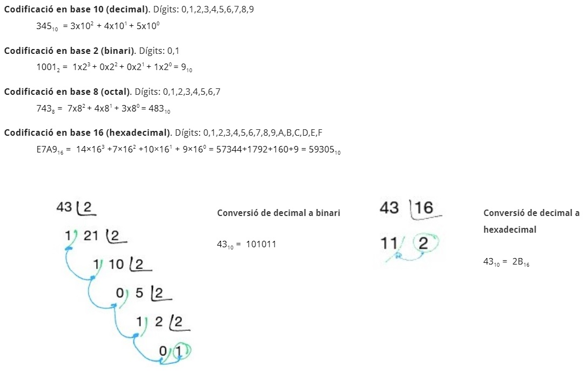
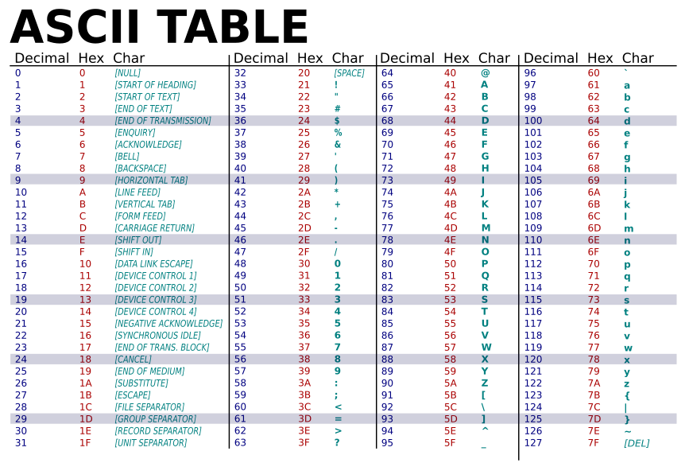
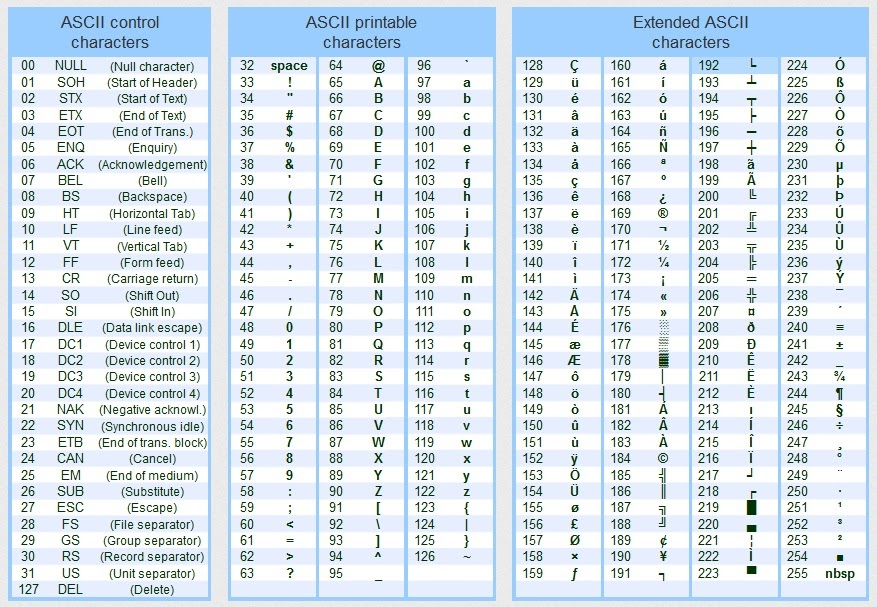
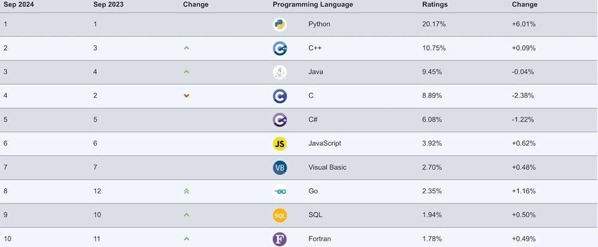

# 1. Introducció a la programació
## 1.1. Orígens de la programació
La informàtica i la computació han avançat gràcies a importants científics i inventors. Entre ells destaquen:

- **Joseph Marie Jacquard**: va automatitzar el teler de Jacquard usant targetes perforades.
- **Charles Babbage**: va crear la màquina diferencial i l'analítica, basada en el teler de Jacquard. 
- **Ada Lovelace**: va desenvolupar programes per a la màquina analítica de Babbage i va ser la primera programadora, 
utilitzant instruccions condicionals i iteratives. 
- **Alan Turing**: va crear la màquina de Turing i és considerat el pare de la informàtica moderna, 
amb treballs en informàtica teòrica i criptoanàlisi. 
- **Grace Hopper**: programadora del Harvard Mark I, va crear el primer compilador i el llenguatge COBOL. 

## 1.2. Llenguatges de programació

### Introducció
- **Codi font**: fitxers amb les instruccions del programa.
- **Linker**: insereix funcions de llibreries al codi objecte i crea l'arxiu executable.
- **Llibreria**: col·lecció de codi predefinit que facilita la programació.

El **llenguatge de programació** permet establir comunicacions entre l'home i lka màquina, i es classifiquen
segons el **nivell d'abstracció**, i el **tipus de traducció** al llenguatge màquina.

### Nivells d'abstracció

#### Alt nivell
Expressa els algorismes d'una manera adequada a la capacitat cognitiva humana, alguns exemples son el 
C, C++, C#, JAVA i Python, entre d’altres.

#### Baix nivell
És quan els algorismes exerceixen un control directe sobre el maquinari i estan condicionats per 
l'estructura física de les computadores que el suporten, son fets servir per programar tasques crítiques 
dels sistemes operatius, d'aplicacions en temps real o controladors de dispositius i tenen un baix nivell d'abstracció.

Hi ha dos tipus principals: el **llenguatge binari** i el **assemblador**.

### Tipus de traducció dels programes
#### Llenguatges compilats
Tradueixen (compilen) el codi per formar un arxiu executable comprensible per a la màquina, 
i no cal repetir el procés de compilació cada vegada. 

Exemples: C, C++, C#, Fortran, Pascal, Haskell i Visual Basic.

#### Llenguatges interpretatats
Tradueixen (interpreten) el codi pas a pas (instrucció per instrucció) i aquest procés es repeteix 
cada vegada que es vol executar de nou. Permeten el tipus dinàmic de dades per el que no es necessari inicialitzar variables 
amb un tipus concret, i pot canviar de tipus conforme s'executa.

Exemples: Python, PHP, JavaScript, Ruby, Perl i MATLAB.

#### Java, un cas especial
Tradueix el codi font a un llenguatge intermedi (**bytecode**), i després Tradueix el llenguatge intermedi a un 
llenguatge comprensible per la màquina, fent servir la **JVM** (Java Virtual Machine) específica 
per al sistema operatiu on s'executa.

### Com executa un programa l’ordinador ?
1. S’introdueixen les dades a l’ordinador 
2. El processador executa les instruccions 
3. Els resultats de les operacions s’emmagatzemen a la RAM 
4. Els resultats finals s’emmagatzemen al disc dur

### Com codifica la informació l'ordinador?

En el cas de la codificació de caràcters, es fa servir la taula **ASCII** i la taula **Unicode**.

## 1.3. Classificació dels llenguatges i paradigmes de programació

### Generacions dels llenguatges de programació

#### Primera generació: llenguatge màquina (binari).
- Avantatges: molt ràpid i eficient.
- Inconvenients: difícil d'aprendre, entendre i localitzar errors.
#### Segona generació: llenguatge assemblador.
- Avantatges: més fàcil d'entendre que el binari, permet modificacions i correccions més senzilles.
- Inconvenients: depèn de l'arquitectura de la màquina i requereix un assemblador.

#### Tercera generació: llenguatge d'alt nivell (C, Java).
- Avantatges: semblant al llenguatge humà, redueix el nombre de línies de codi i és reutilitzable en diferents 
màquines amb compiladors.
- Inconvenients: requereix compiladors/intèrprets específics per a cada màquina.

#### Quarta generació: llenguatges no procedimentals.
- Avantatges: fàcils d'entendre i aprendre, ràpids per desenvolupar aplicacions, menys propensos a errors. 
- Inconvenients: alt consum de memòria i menor control sobre el maquinari.

#### Cinquena generació: basats en intel·ligència artificial.
- Avantatges: les màquines poden prendre decisions, redueix l'esforç del programador. 
- Inconvenients: codi complex, necessita molts recursos i és costós.

### Paradigmes de programació

Un paradigma de programació defineix els mètodes per realitzar càlculs i organitzar les tasques d'un programa. Cada paradigma representa una filosofia particular per a dissenyar solucions. Els principals són:

#### Programació imperativa o per procediments: 
Basada en instruccions seqüencials per resoldre problemes. Exemples: C, BASIC, Pascal.

#### Programació orientada a objectes: 
Encapsula dades i funcions en objectes. Exemples: JAVA, Smalltalk.

#### Programació dirigida per esdeveniments: 
L'execució es basa en esdeveniments del sistema. Exemples: Visual Basic.

#### Programació declarativa: 
Es descriu el problema amb regles i propietats, sense indicar com resoldre'l. Exemples: Prolog.

#### Programació multiparadigma: 
Combina diversos paradigmes per aprofitar-ne els avantatges. Exemples: Lisp, Python, C++.

## 1.4. Els llenguatges de programació més populars

### Quin és el millor llenguatge de programació? 
Depén de a qui es pregunti, s'ha de tenir en compte el següent:
- Propòsit del programa
- Entorn d’execució
- Versatilitat del llenguatge
- Tendències del mercat

Tot i de l’existència dels llenguatges multipropòsit, l’opció ideal serà aquella que solucioni 
de manera més eficient, el problema plantejat.

Els llenguatges més utilitzats:

