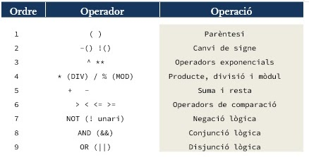

# Disseny d'algorismes

## 2.1. Anàlisi
En aquesta fase inicial, s'analitza el problema a resoldre: quina és la solució requerida, quines dades tenim, 
com es pot solucionar i quins errors poden sorgir. Si hi ha informació addicional, com fórmules, s'ha d'incloure.

Un algorisme ben format ha de ser:

- Precís: ha d'indicar cada pas per resoldre el problema. 
- Ben definit: sempre produeix la mateixa sortida amb les mateixes dades.
- Finit: ha de finalitzar en algun moment.
- Robust: ha de gestionar qualsevol entrada de manera clara.
- Transportable: ha de funcionar en qualsevol maquinari o sistema operatiu.

A més, cal resoldre preguntes sobre què es demana, quines dades tenim, quines operacions calen, si la solució resol 
el problema i si hi pot haver errors.

### 2.1.1. Les dades

#### Què és una dada?
Una dada és una representació simbòlica d'una característica d'una entitat, sense valor semàntic per si sola. 
Quan és processada, pot ser útil per a càlculs o presa de decisions. Els programes necessiten dades d'entrada, 
les transformen, i generen dades de sortida valuoses per a l'usuari. No totes les dades són iguals: poden ser nombres, 
textos, etc., i el tipus de dada defineix els valors vàlids i les transformacions que es poden fer sobre elles.

#### Tipus de dades
Els tipus de dades que es faran servir en el disseny d'algorismes (i la seva posterior implementació en un llenguatge d'alt nivell) es classifiquen en:

**Simples**

- numèriques
  - enter: representa un valor numèric, positiu o negatiu, sense cap decimal
  - real: representa un valor numèric, positiu o negatiu, amb decimals
- no numèriques
  - booleà: representa un valor de tipus lògic per tal d’establir la certesa o falsedat d’un estat o afirmació
  - caràcter, cadena de caràcters: representa una unitat fonamental de text usada en qualsevol alfabet, un nombre o un signe de puntuació o exclamació

**Estructurades**
- internes
  - estàtiques (registres, vectors, taules)
  - dinàmiques (llistes, cues, piles, arbres)
- externes
  - fitxers
  - bases de dades

### 2.1.2. Les expressions

#### Què és una expressio?
Una expressió és la representació de diversos operands, units entre ells mitjançant operadors, 
per tal de realitzar una acció sobre ells, ja sigui aritmètica, lògica o d'ambdues:
```c#
5.3 == ‘4’
5 || 4.0
!(40>25)
10<20 && 40>25
5 != 6
num = 3 * entrada
```

Una variable emmagatzema dades a la memòria i es pot modificar en qualsevol moment.
Una constant es similar, però es defineix a l'inici i ja no pot ser modificada.
Els operadors permeten assignar valors, operar i establir condicions, i hi ha els següents tipus:
- assignació: x = y
- aritmètics:
  - addició: x = x + y
  - sostracció: x = x - y
  - multiplicació: x = x * y
  - divisió: x = x / y
  - mòdul: x = x % y
  - increment: ++
  - decrement: --
  - potenciació: **
- comparació:
  - == (igual)
  - != (diferent)
  - < (menor que),  > (més gran que)
  - <=  (menor o igual que), >= (més gran o igual que)

Ordre d'avaluació d'expressions:



A l'hora d'avaluar les expressions lògiques farem servir les taules de veritat de l'àlgebra de Boole:


## 2.2. Disseny

Durant aquesta fase es descompon el problema en diverses fases i nivells d'abstracció, habitualment fent servir estil top-down.

### 2.2.1. Especificació

Depenent del problema, aquest es descomposarà de diverses formes, com ara:

-Pseudocodi, descripció d'alt nivell de l'algorisme.
-Diagrames de flux, representació gràfica.
-Diagrames de Nassi-Shneiderman, representació gràfica.

### 2.2.2. Pseudocodi

El pseudocodi és una representació d'un algorisme a molt alt nivell del llenguatge, on dediques les primeres línies a establir variables (les quals poden ser simples o compostes) i constants.

El pseudocodi serveix per escriure amb les nostres paraules què volem que el codi faci i com volem que ho faci, sense entrar en un llenguatge específic, per la qual cosa també es té la possibilitat d'afegir condicionals o bucles (for, while)

### 2.2.3. Diagrames de Flux

Els diagrames de flux són una representació gràfica simple d'un programa, consisteixen en un diagrama en cascada amb diferents formes connectades per linies les quals determinen de quin tipus és una acció, ja sigui un inici o un final de programa o accions dins el mateix, com ara un input, un procés o una decisió.

### 2.2.4. Diagrames de Nassi-Shneiderman

Com els diagrames de flux, els diagrames de Nassi-Shneiderman són una representació gràfica en forma de diagrama en cascada, però aquests no estàn separats per línies sinó que són completament compactes en forma de rectangle, dividint-se en dos rectangles iguals en cas que hi hagi un condicional amb diferents sortides, però mantenint la seva forma compacte.

### 2.2.5. Jocs de Proves

Qualsevol programa pot tenir errors inesperats o que no s'han tingut en compte, i per això serveixen els jocs de proves.

Els jocs de proves són una forma de documentar les possibles sortides d'un programa amb diferents entrades que se li donin a aquest per tal de corregir i millorar alguns programes mitjançant prova i error.

Un joc de proves funciona fent una taula amb les diferents entrades i sortides d'un programa conjuntament amb tots els canvis i passos entremitjos que hi puguin haver, i anotant cada canvi que rep l'entrada durant el procés fins que el programa escrigui la sortida. És sumament important provar valors vàlids, invàlids i límits per fer-se una idea precisa de l'estat del teu programa.